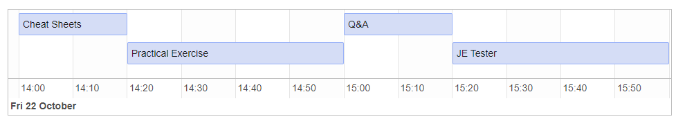

   
```{r setup, include=FALSE}
knitr::opts_chunk$set(echo = FALSE)

# Learn more about creating websites with Distill at:
# https://rstudio.github.io/distill/website.html

# Learn more about publishing to GitHub Pages at:
# https://rstudio.github.io/distill/publish_website.html#github-pages

```
   
# ● 3회 - 2024년 5월 (Offline)
    
## Prerequisite
   
1. Rstudio [R | Docker | Rocker | 윈도우즈에서 도커로 Rstudio 환경 사용하기 | tidyverse](https://joy-accounting.netlify.app/2023-12-18-docker-rocker-rstudio/) 에 따라서 설치한다.
   
1. [R 기초 강의](https://youtu.be/0DYFRSykkXQ?si=0mC3yk5reuiEdjGC) 를 시청하고 최대한 따라서 입력 및 실행해 본다.   
     
    
      
```{r}

```
    
    
    
## 오전 Session 
    
1. Rstudio [R | Docker | Rocker | 윈도우즈에서 도커로 Rstudio 환경 사용하기 | tidyverse](https://joy-accounting.netlify.app/2023-12-18-docker-rocker-rstudio/) 설치 확인
1. 오늘의 할 일 - 빠르게 전체 Process (숲을 보고 결과물 확인)
1. rmarkdown과 Quarto 소개  
1. R and Quarto - qmd 파일에 R코딩 해보기 (Analisys를 위하여 사용한 프로그램 - R.version)
1. Journal Entry Analisys - A01 (사전준비, 열 이름 정돈, 날짜형, Factor, Character, skimr)
1. Journal Entry Analisys - A02 (차변 대변 차이 확인) 
   
### 설명 대상
   
* Variable assign    
* Pipe operator   
* dplyr(select, , group_by, summarise, mutate, rename)   
   
   
## 점심식사
    
정규 연수가 아니므로 점심식사가 제공되지 않는 바 양해 부탁드립니다. 각자 주변 식당("서울역 게이트웨이타워 식당"을 검색하면 정보를 얻기 쉽습니다.)을 이용해 주시기 바랍니다. 
     
## 오후 Session  
     
    
1. JE data 다루기 실습 계속 - A03
1. JE data 다루기 실습 계속 - B01
1. 시각화 (ggplot2)
1. 질의 응답   
   
   
### 설명 대상
    
* dplyr(slice, left_jon, semi_join, mutate_all, distinct, pull, arrange, bind_rows),   
* stringr(str_detect)
* ggplot2(geom_bar, geom_col) , base(prop.table, split)
   
    
    
### Further study
      
[챗GPT 코딩](https://r2bit.com/gpt-coding/)
   
[챗GPT 쿼토](https://r2bit.com/gpt-quarto/)
   
[R 을 활용한 데이터과학 2e](https://r4ds.hadley.nz/)
   
    
   
# ● 2회  - 2021년 10월 22일  (Online in Teams)
    
    
### 진행 순서  
   
```{r}

```
   
1. Request   
1. Rstudio - Cheat Sheets 소개 (dplyr, rmarkdown한글)   
1. rmarkdown 
1. 새로운 JE data에 Rmarkdown code 적용 시연    
1. 질의 응답   
1. JE Tester by Joy 소개하기    
   
    
[Journal Entry Tester by Joy 0.1.0](https://joy-accounting.netlify.app/2021-08-26-journal-entry-tester-by-joy-0-1-0/)
   
    
    
### Further study
   
[R 을 활용한 데이터과학](https://bookdown.org/sulgi/r4ds/)
   
# ● 1회  -  2021년 8월 19일 (Online in Teams)
    
### 진행 순서
    
1. 인사 및 사전 준비 확인 -Short
2. 빠르게 전체 Process
3. 하나씩 따라하기
4. 숙제 검사
5. R 소개와 할 수 있는 것 장점 등
6. 소감 발표
   
   
### Further study
   
1. [Must Learning with R](https://wikidocs.net/book/4315)
2. [재현가능한 과학적 분석을 위한 R](https://statkclee.github.io/r-gapminder-kr/)
3. [BOOKDOWN](https://bookdown.org/)
4. [R을 이용한 퀀트 투자 포트폴리오 만들기](https://hyunyulhenry.github.io/quant_cookbook/)
    
    
    
<br><br><br><br>      
      
| 조이회계  Joy Accounting |
|---------------------------|
| https://joy-accounting.netlify.com/ |
   
